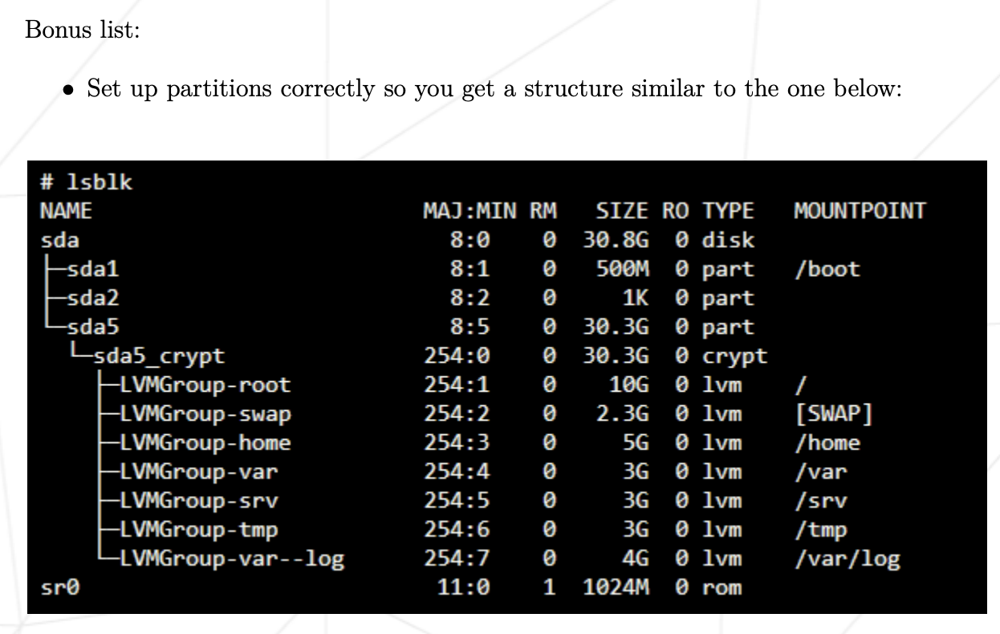

# Information:

### Virtual Machines
Explain simply:
- How a virtual machine works.

- The purpose of virtual machines.

### OS: Debian
Explain simply:
- Your choice of operating system.

- The basic differences between CentOS and Debian.

### Aptitude vs. Apt
Differences between aptitude and apt?

### AppArmor
What is AppArmor?

# During eval:
## Simple set-up:
- Check that the signature contained in "signature.txt" is identical to that of the ".vdi" file of the virtual machine to be evaluated. A simple "diff" should allow you to compare the two signatures. If necessary, ask the student being evaluated where their ".vdi" file is located.
- Ensure that the machine does not have a graphical environment at launch.
- A password will be requested before attempting to connect to this machine (must follow the rules imposed in the subject).
- Finally, connect with a user with the help of the student being evaluated. This user must not be root.
- Check that the UFW service is started with the help of the evaluator.
- Check that the SSH service is started with the help of the evaluator.
- Check that the chosen operating system is Debian or CentOS with the help of the evaluator.

## User, group and password
- A user with the login of the student being evaluated has to be already present on the virtual machine. Check that it has been added and that it belongs to the "sudo" and "user42" groups.

- Make sure the rules imposed in the subject concerning the password policy have been put in place by following the following steps:
- Create new user.
- Assign password of choice (respecting subject rules) and explain how these rules were set up on your virtual machine.
- Show one or two modified files.
- Create a group named "evaluating" and assign it to this new user.
- Finally, check that this user belongs to the "evaluating" group.
- Finally, explain the advantages of this password policy, as well as the advantages and disadvantages of its implementation.

## Hostname
- Check that the hostname of the machine is correctly formatted as follows: login42 (login of the student being evaluated).

- Modify this hostname by replacing the login with evaluator's login, then restart the machine. If on restart, the hostname has not been updated, the evaluation stops here.

- You can now restore the machine to the original hostname.

## Partitions
- Show the partitions for this virtual machine.
Using the command `lsblk` will display the partitions.

- Compare the output with the example given in the subject. Please note: if bonuses, refer to the bonus example:

- Give a brief explanation of how LVM works and what it is all about.

## Sudo
- Check that the "sudo" program is properly installed on the virtual machine.

- Show assigning new user to the "sudo" group.

- The subject imposes strict rules for sudo. First explain the value and operation of sudo using examples.

- Show the implementation of the rules imposed by the subject.

- Verify that the "/var/log/sudo/" folder exists and has at least one file.
Check the contents of the files in this folder, you should see a history of the commands used with sudo.

- Run a command via sudo. See if the file(s) in the "/var/log/sudo/" folder have been updated.

## UFW
- Check that the "UFW" program is properly installed on the virtual machine.

- Check that it is working properly.

- Explain basically what UFW is and the value of using it.

- List the active rules in UFW. A rule must exist for port 4242.

- Add a new rule to open port 8080. Check that this one has been added by listing the active rules.

- Finally, delete this new rule with the help of the student being evaluated.

## SSH
- Check that the SSH service is properly installed on the virtual machine.

- Check that it is working properly.

- Explain basically what SSH is and the value of using it

- Verify that the SSH service only uses port 4242.

- Use SSH in order to log in with the newly created user:
- you can use a key or a simple password.
- make sure you cannot use SSH with the "root" user.

## Script
- Show how the script works, by showing the code.
- Explain what "cron" is.
- Explain how it was set up so that it runs every 10 minutes from when the server starts.
- Ensure that this script runs every minute, make sure that the script runs with dynamic values correctly.
- Make the script stop running when the server has started up, without modifying the script itself. (you'll have to restart one last time).
- At startup, check if the script still exists in the same place, rights have remained unchanged, and not been modified.

## Bonus
Check, with the help of the subject and the student being evaluated, the bonus
points authorized for this project:
- Setting up partitions is worth 2 points.
--> Compare the output with the example given in the subject. Please note: if bonuses, refer to the bonus example:

- Setting up WordPress, only with the services required by the subject, is worth 2 points.
- The free choice service is worth 1 point.
Verify and test the proper functioning and implementation of each extra service.
For the free choice service, the student being evaluated has to give you a
simple explanation about how it works and why they think it is useful.
Please note that NGINX and Apache2 are prohibited.
