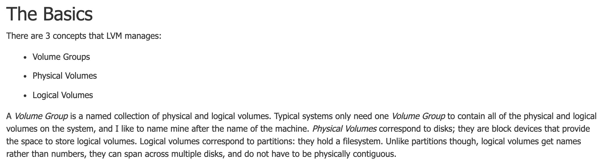

# Eval Prep 

`ssh -p 4242 username@localhost` to connect to VM from your host (physical) machine via ssh.    

### Virtual Machines  
A Virtual Machine is a "guest machine" made of a virtual/software-defined/code-only computer running on a physical "host" server (hardware like a computer/laptop/phone).  
A VM "borrows" dedicated amount of storage, CPU and memory from a physical host computer of remote server. A VM is a computer file, typically called an image, that behaves like an actual computer. The virtual machine is partitioned from the rest of the system, meaning that the software inside a VM can't interfere with the host computer's primary operating system.
The purpose of VMs are is for example to run a different operating system. While virtual machines run like individual computers with individual operating systems and applications, they have the advantage of remaining completely independent of one another and the physical host machine. A piece of software called a hypervisor, or virtual machine manager, lets you run different operating systems on different virtual machines at the same time. This makes it possible to run Linux VMs, for example, on a Windows OS, or to run an earlier version of Windows on more current Windows OS.  
Some examples of using a VM:  
- Building and deploying apps.  
- Trying out a new operating system (OS), including beta releases.  
- Backing up your existing OS.  
- Accessing virus-infected data.   
- Running an old application by installing an older OS.  
- Running software or apps on operating systems that they weren't originally intended for.  

### OS: Debian
An Operating System (OS) is an interface between a computer user and computer hardware. CentOS and Debian are both free/open source operating systems/distributions for Linux.   
Debian vs CentOS:  
*CentOS:*  
- downstream rebuild of the commercial Red Hat Enterprise Linux distribution.  
*Debian:*  
- upstream distribution that is the base for other distributions, including the Ubuntu Linux distribution.  

"Debian is highly recommended if you are new to system administration. Setting up CentOS is quite complex." Debian generally has more up to date packages and it is easier to upgrade to a newer version. Debian has desktop friendly applications and GUI. In sum: Debian is easier to install and configure than CentOS.  
So, I chose Debian.  

### Aptitude vs. Apt
Aptitude and apt-get are tools which handle package management. Both are capable of handling all kinds of activities on packages including installation, removal, search etc. But still there are differences between both the tools which make users prefer one over the other:  

*Apt, Advanced Packaging Tool:*  
- Apt or Advanced Packaging Tool is a free and open source software which gracefully handles software installation and removal. Apt is whole command line with no GUI.  

*Aptitude:*  
- Aptitude is front-end to advanced packaging tool which adds a user interface to the functionality, thus allowing a user to interactively search for a package and install or remove it.  

Apt vs. Aptitude:  
Aptitude is a high-level package manager while Apt is lower-level package manager which can be used by other higher-level package managers. Aptitude has more functionality than Apt.  
While Apt lacks UI, Aptitude has a text-only and interactive UI. Aptitude has a better package management than Apt.  

### AppArmor
AppArmor ("Application Armor") is an important security feature, that provides “mandatory access control” (MAC) security. AppArmor allows developers to restrict the actions processes/programs can take. AppArmor is particularly useful for restricting software that may be exploited, such as a web browser or server software.  
To view AppArmor’s status, run the following command in a terminal:  
`sudo apparmor_status` or `sudo aa-status` will display AppArmor status  

### SSH  
SSH, also known as Secure Shell or Secure Socket Shell, is a network protocol that gives users, particularly system administrators, a secure way to access a computer over an unsecured network.  

### Set-up
- `sudo adduser <user_name>` to create new user  
- `sudo ufw status` will pisplay UFW status  
- `sudo service ssh status` will display SSH status  
- `head -n 2 /etc/os-release` will display OS chosen  

## User, group and password
- `getent group sudo` will display users in group sudo  
- `getent group user42` will display users in group user42  
- `sudo adduser <user_name>` will create a new user  
- `nano /etc/login.defs` to show password expire policy  
and `nano /etc/pam.d/common-password` to show password set-up rules  
- `sudo addgroup <group_name>` to create a new group  
- `sudo adduser <user_name> <group_name>` to assign user to group  
- `getent group <group_name>` will display users in group  
- Advantages password policy: force users to use uppredictable passwords and change password regularly -> more secure.  
- Disadvantages password policy: not every password more secure + limited the options/kinds of passwords -> weakens the system.  

## Hostname
- to change hostname:  
`hostnamectl set-hostname <server_name>` and   
`sudo nano /etc/hosts` + change previous hostname with new hostname  
- `sudo reboot` to reboot the sytem  

## Partitions
- `lsblk` will display the partitions  
- To compare partitions, refer to the bonus example:  
  

- LVM (Logical Volume Manager) is a system of managing logical volumes, or filesystems, that is much more advanced and flexible than the traditional method of partitioning a disk into one or more segments and formatting that partition with a filesystem.  

## Sudo
- `sudo` stands for "superuser do"  
- `sudo adduser <user_name> <group_name>` to assign user to group  
- `cd /var/log/sudo/00/00 && ls` to go to directory where sudo-history-file should be and show contents of directory  
- You'll see directories with names like 01 2B 9S 4D etc. They contain the sudo logs!  
- `sudo apt update` = example of sudo command  
- `cd <new_directory> && ls` to check last sudo command  

## UFW
- UFW: Uncomplicated Firewall = command-line interface to manipulate your firewall  
- `sudo ufw status` to check UFW status and list the active rules in UFW  
- `sudo ufw allow <port_number>` to allow a new rule  
- `sudo ufw delete <rule_number>` OR `sudo ufw delete allow <port_number>` to delete a rule  
- `sudo ufw deny <port_number>` to deny rule  

## SSH
- SSH, also known as Secure Shell or Secure Socket Shell, is a network protocol that gives users, particularly system administrators, a secure way to access a computer over an unsecured network.  
- `sudo service ssh status` will display SSH status and ports listening  
- `ssh -p <port> <username>@<ip_address>or<hostname>` to log in with the user with ssh   

## Script
- Cron allows Linux and Unix users to run commands or scripts at a given date and time. You can schedule scripts to be executed periodically. Very useful for backups and cleaning directories etc. The cron service runs in the background and constantly checks the `/etc/crontab` file.  
- `sudo crontab -e` to open crontab file  
- to make the script running every minute, change lines in crontab file to:  
`*/1 * * * * /path/to/monitoring.sh`  
`*/1 * * * * sleep 30s && /path/to/monitoring.sh`  
- delete `@reboot /path/to/monitoring.sh` to make script stop running at server start up  
- `sudo reboot` to restart the machine  

## Bonus
Check, with the help of the subject and the student being evaluated, the bonus
points authorized for this project:
- Setting up partitions is worth 2 points.
--> Compare the output with the example given in the subject. Please note: if bonuses, refer to the bonus example:

- Setting up WordPress, only with the services required by the subject, is worth 2 points.
- The free choice service is worth 1 point.
Verify and test the proper functioning and implementation of each extra service.
For the free choice service, the student being evaluated has to give you a
simple explanation about how it works and why they think it is useful.
Please note that NGINX and Apache2 are prohibited.

# Wooooop finally finished baby!