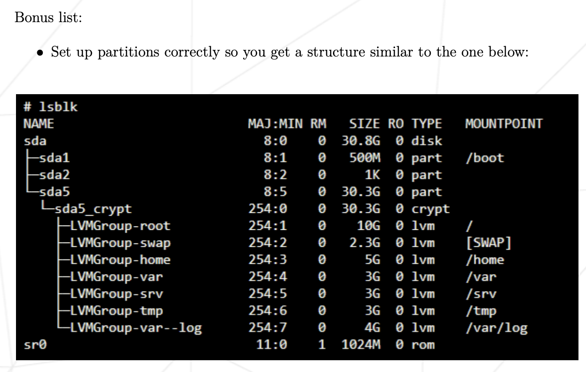

# Eval Preparations 

### Virtual Machines
A Virtual Machine is a "guest machine" made of a virtual/software-defined/code-only computer running on a physical "host" server (hardware like a computer/laptop/phone). 
A VM "borrows" dedicated amount of storage, CPU and memory from a physical host computer of remote server. A VM is a computer file, typically called an image, that behaves like an actual computer. The virtual machine is partitioned from the rest of the system, meaning that the software inside a VM can't interfere with the host computer's primary operating system.
The purpose of VMs are is for example to run a different operating system. While virtual machines run like individual computers with individual operating systems and applications, they have the advantage of remaining completely independent of one another and the physical host machine. A piece of software called a hypervisor, or virtual machine manager, lets you run different operating systems on different virtual machines at the same time. This makes it possible to run Linux VMs, for example, on a Windows OS, or to run an earlier version of Windows on more current Windows OS.
Some examples of using a VM: 
Here are a few ways virtual machines are used:
- Building and deploying apps.
- Trying out a new operating system (OS), including beta releases.
- Backing up your existing OS.
- Accessing virus-infected data 
- Running an old application by installing an older OS.
- Running software or apps on operating systems that they weren't originally intended for.

### OS: Debian
An Operating System (OS) is an interface between a computer user and computer hardware. CentOS and Debian are both free/open source operating systems/distributions for Linux. 
Debian vs CentOS:

*CentOS:*

- downstream rebuild of the commercial Red Hat Enterprise Linux distribution.

*Debian:*

- upstream distribution that is the base for other distributions, including the Ubuntu Linux distribution.

"Debian is highly recommended if you are new to system administration. Setting up CentOS is quite complex." Debian generally has more up to date packages and it is easier to upgrade to a newer version. Debian has desktop friendly applications and GUI.
So, I chose Debian.

### Aptitude vs. Apt
Aptitude and apt-get are tools which handle package management. Both are capable of handling all kinds of activities on packages including installation, removal, search etc. But still there are differences between both the tools which make users prefer one over the other:

*Apt, Advanced Packaging Tool:*

Apt or Advanced Packaging Tool is a free and open source software which gracefully handles software installation and removal. Apt is whole command line with no GUI.

*Aptitude:*

Aptitude is front-end to advanced packaging tool which adds a user interface to the functionality, thus allowing a user to interactively search for a package and install or remove it.

Apt vs. Aptitude:

Aptitude is a high-level package manager while Apt is lower-level package manager which can be used by other higher-level package managers. Aptitude has more functionality than Apt.
While Apt lacks UI, Aptitude has a text-only and interactive UI. Aptitude has a better package management than Apt.

### AppArmor
AppArmor is an important security feature, that provides “mandatory access control” (MAC) security. In effect, AppArmor allows developers to restrict the actions processes can take. AppArmor is particularly useful for restricting software that may be exploited, such as a web browser or server software.
To view AppArmor’s status, run the following command in a terminal:

`sudo apparmor_status` or `sudo aa-status` will display AppArmor status

# During eval:
## Simple set-up:
- Check that the signature contained in "signature.txt" is identical to that of the ".vdi" file of the virtual machine to be evaluated. A simple "diff" should allow you to compare the two signatures. If necessary, ask the student being evaluated where their ".vdi" file is located.
- Ensure that the machine does not have a graphical environment at launch.
- A password will be requested before attempting to connect to this machine (must follow the rules imposed in the subject).
- Finally, connect with a user with the help of the student being evaluated. This user must not be root.
- Check that the UFW service is started with the help of the evaluator.

`sudo ufw status` will pisplay UFW status.

- Check that the SSH service is started with the help of the evaluator.

`sudo service ssh status` will display SSH status.

- Check that the chosen operating system is Debian or CentOS with the help of the evaluator.

`head -n 2 /etc/os-release` will display OS chosen.

## User, group and password
- A user with the login of the student being evaluated has to be already present on the virtual machine. Check that it has been added and that it belongs to the "sudo" and "user42" groups.

`getent group sudo` will display users in group sudo

`getent group user42` will display users in group user42

- Make sure the rules imposed in the subject concerning the password policy have been put in place by following the following steps:
- Create new user.

`sudo adduser <user_name>` will create a new user

- Assign password of choice (respecting subject rules) and explain how these rules were set up on your virtual machine.
- Show one or two modified files.
- Create a group named "evaluating" and assign it to this new user.

`sudo addgroup <group_name>` will create a new group

`sudo usermod -aG <group_name> <user_name>` will assign user to group

- Finally, check that this user belongs to the "evaluating" group.

`getent group evaluating` will display users in group evaluating

- Finally, explain the advantages of this password policy, as well as the advantages and disadvantages of its implementation.

## Hostname
- Check that the hostname of the machine is correctly formatted as follows: login42 (login of the student being evaluated).
- Modify this hostname by replacing the login with evaluator's login, then restart the machine. If on restart, the hostname has not been updated, the evaluation stops here.

`hostnamectl set-hostname <server_name>` will change hostname

- You can now restore the machine to the original hostname.

## Partitions
- Show the partitions for this virtual machine.

`lsblk` will display the partitions.

- Compare the output with the example given in the subject. Please note: if bonuses, refer to the bonus example:

- Give a brief explanation of how LVM works and what it is all about.

## Sudo
- Check that the "sudo" program is properly installed on the virtual machine.
- Show assigning new user to the "sudo" group.
- The subject imposes strict rules for sudo. First explain the value and operation of sudo using examples.
- Show the implementation of the rules imposed by the subject.
- Verify that the "/var/log/sudo/" folder exists and has at least one file.
Check the contents of the files in this folder, you should see a history of the commands used with sudo.

`cd /var/log/sudo/00/00` go to directory where sudo-history-file should be

`ls` show contents of directory

- Run a command via sudo. See if the file(s) in the "/var/log/sudo/" folder have been updated.

`sudo apt update`

`ls`

`sudo echo hello` 

`cd <nameofnewdirectory> && ls`

## UFW
- Check that the "UFW" program is properly installed on the virtual machine.
- Check that it is working properly.
- Explain basically what UFW is and the value of using it.
- List the active rules in UFW. A rule must exist for port 4242.
- Add a new rule to open port 8080. Check that this one has been added by listing the active rules.
- Finally, delete this new rule with the help of the student being evaluated.

## SSH
- Check that the SSH service is properly installed on the virtual machine.
- Check that it is working properly.
- Explain basically what SSH is and the value of using it
- Verify that the SSH service only uses port 4242.
- Use SSH in order to log in with the newly created user:
- you can use a key or a simple password.
- make sure you cannot use SSH with the "root" user.

## Script
- Show how the script works, by showing the code.
- Explain what "cron" is.
- Explain how it was set up so that it runs every 10 minutes from when the server starts.
- Ensure that this script runs every minute, make sure that the script runs with dynamic values correctly.
- Make the script stop running when the server has started up, without modifying the script itself. (you'll have to restart one last time).
- At startup, check if the script still exists in the same place, rights have remained unchanged, and not been modified.

## Bonus
Check, with the help of the subject and the student being evaluated, the bonus
points authorized for this project:
- Setting up partitions is worth 2 points.
--> Compare the output with the example given in the subject. Please note: if bonuses, refer to the bonus example:

- Setting up WordPress, only with the services required by the subject, is worth 2 points.
- The free choice service is worth 1 point.
Verify and test the proper functioning and implementation of each extra service.
For the free choice service, the student being evaluated has to give you a
simple explanation about how it works and why they think it is useful.
Please note that NGINX and Apache2 are prohibited.

# Wooooop finally finished baby!