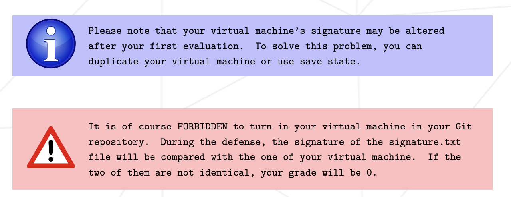

# Submission and peer-evaluation

> You only have to turn in a signature.txt file at the root of your Git repository. You must paste in it the signature of your machine’s virtual disk. To get this signature, you first have to open the default installation folder (it is the folder where your VMs are saved):
> MacOS: ~/VirtualBox VMs/

> Then, retrieve the signature from the ".vdi" file (or ".qcow2 for UTM’users) of your virtual machine in sha1 format. Below are 4 command examples for a centos_serv.vdi file:
> MacOS: shasum centos_serv.vdi
> 
> This is an example of what kind of output you will get:  
> • 6e657c4619944be17df3c31faa030c25e43e40af

**PAY ATTENTION:**

So, for the eval: since you have to compare the signature.txt in your git with the signature of the VM you're doing the eval on, **make a snapshot of your VM!** When you reset the initial state of the snapshot after the eval, you will have the same signature for all 3 evals!!!
