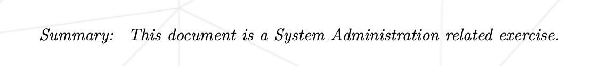
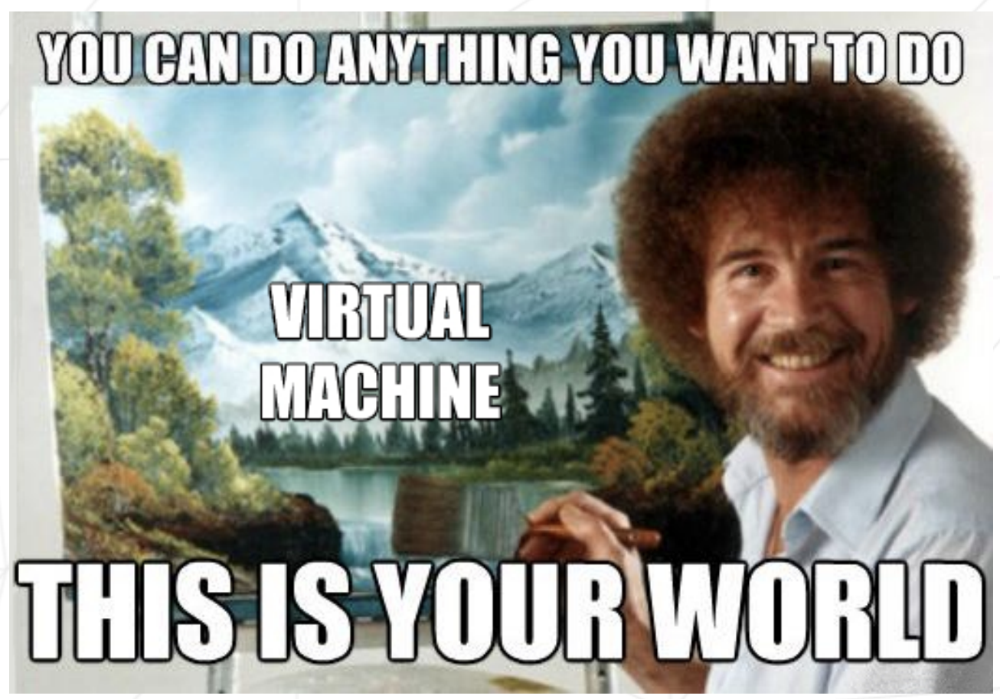

# BORN2BEROOT

                    🌈 ✨ My Most Hated Project ✨ 🌈

You can see why...

Nice try of **42** to make it all a bit better:

### SO to copain Arrtthhuur for making life just a bit easier < 3

## General guidelines:
• The use of VirtualBox (or UTM if you can’t use VirtualBox) is mandatory.
• You only have to turn in a signature.txt file at the root of your repository. You
must paste in it the signature of your machine’s virtual disk. Go to Submission and
peer-evaluation for more information.

## Contents:
● Subject
● Eval Sheet
● Sudo
● Hostname
● LVM
● User and groups
● SSH
● UFW
● Password
● Script
● Bonus
● During Eval

## Setting Up Your VM:
I followed this link to set up my VM:

https://www.brianlinkletter.com/2012/10/installing-debian-linux-in-a-virtualbox-virtual-machine/

## Hostname
The hostname of your virtual machine must be your login ending with 42 (mverbrug42).

## Password
root password: Waitword4!

## User
In addition to the root user, a user with your login as username has to be present:
mverbrug (password: UserWaitword4!)

## Partitions
To set up the encrypted partitions, I followed my friend Arrtthhuur's tutorial. Yes, you might want to use it too, but ONLY if you promise to star his repo! His magic can be found here: https://github.com/Arrtthhuur/Born2beRoot/blob/main/lvm/README.md#section
For the bonus part, I ended up following https://github.com/HEADLIGHTER/Born2BeRoot-42/blob/main/walkthrough37.txt#L23.

Passphrase: qwerty1234!

"Since it is a matter of setting up a server, you will install the minimum of services. For this reason, a graphical interface is of no user here. It is therefore forbidden to install X.org or any other equivalent graphics server."
--> Deselect Desktop environment and GNOME from software selection during the install in order to get a Debian install without a Graphical User Interface. Also deselect SSH server & standart system utilities.

## Sudo

## SSH

## UFW
