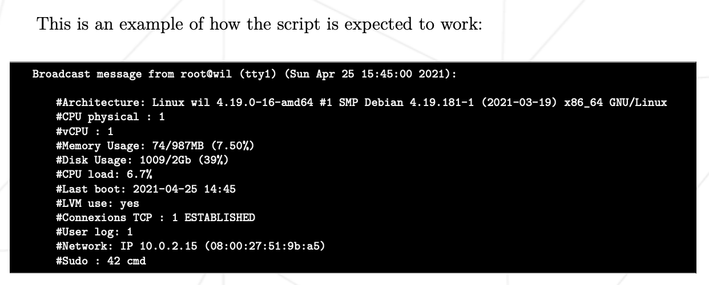
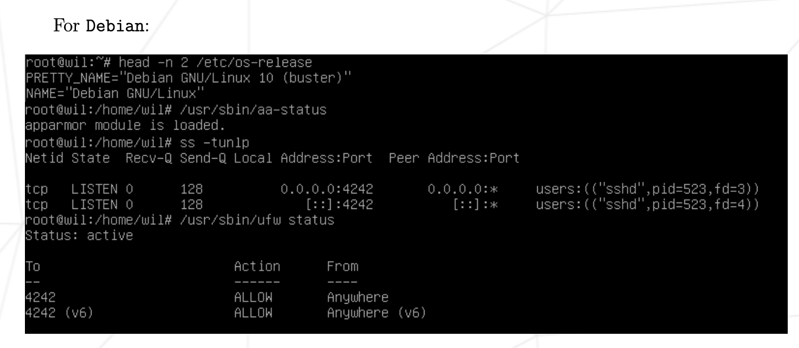

# Script

## Subject
> Finally, you have to create a simple script called monitoring.sh. It must be developed in bash.  
> At server startup, the script will display some information (listed below) on all terminals every 10 minutes (take a look at wall). The banner is optional. No error must be visible.  
> Your script must always be able to display the following information:  
> • The architecture of your operating system and its kernel version.  
> • The number of physical processors.  
> • The number of virtual processors.  
> • The current available RAM on your server and its utilization rate as a percentage.  
> • The current available memory on your server and its utilization rate as a percentage.  
> • The current utilization rate of your processors as a percentage.  
> • The date and time of the last reboot.  
> • Whether LVM is active or not.  
> • The number of active connections.  
> • The number of users using the server.  
> • The IPv4 address of your server and its MAC (Media Access Control) address.  
> • The number of commands executed with the sudo program.

** ! During the defense, you will be asked to explain how this script
works. You will also have to interrupt it without modifying it.
Take a look at cron. ! **

Below are commands you can use to check some of the subject’s requirements:

head -n 2 /etc/os-release

/usr/sbin/aa-status

ss-tunlp

